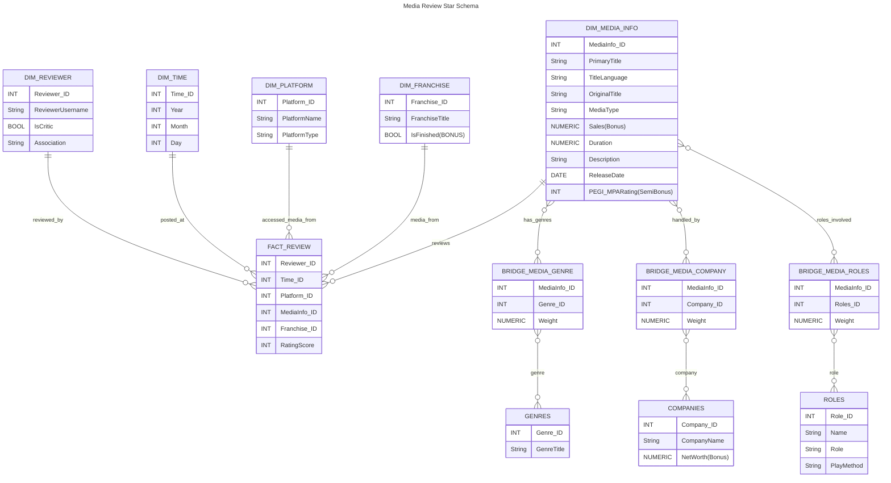

```mermaid
---
title: Media Review Star Schema
---
erDiagram
FACT_REVIEW {
    INT Reviewer_ID
    INT Time_ID
    INT Platform_ID
    INT MediaInfo_ID
    INT Franchise_ID
    INT RatingScore
}

DIM_MEDIA_INFO {
    INT MediaInfo_ID
    String PrimaryTitle
    String TitleLanguage
    String OriginalTitle
    String MediaType
    NUMERIC Sales(Bonus)
    NUMERIC Duration
    String Description
    DATE ReleaseDate
    INT PEGI_MPARating(SemiBonus)
}


BRIDGE_MEDIA_COMPANY{
    INT MediaInfo_ID
    INT Company_ID
    NUMERIC Weight
}

COMPANIES {
    INT Company_ID
    String CompanyName
    NUMERIC NetWorth(Bonus)
}

BRIDGE_MEDIA_GENRE{
    INT MediaInfo_ID
    INT Genre_ID
    NUMERIC Weight
}
GENRES {
    INT Genre_ID
    String GenreTitle
}

BRIDGE_MEDIA_ROLES {
    INT MediaInfo_ID
    INT Roles_ID
    NUMERIC Weight
}

ROLES{
    INT Role_ID
    String Name
    String Role
    String PlayMethod
}

DIM_REVIEWER {
    INT Reviewer_ID
    String ReviewerUsername
    BOOL IsCritic
    String Association
}

DIM_TIME {
   INT Time_ID
   INT Year
   INT Month
   INT Day
}

DIM_PLATFORM {
    INT Platform_ID
    String PlatformName
    String PlatformType
}

DIM_FRANCHISE  { 
     INT Franchise_ID
     String FranchiseTitle
     BOOL IsFinished(BONUS)
}


DIM_REVIEWER ||--o{ FACT_REVIEW : reviewed_by
DIM_MEDIA_INFO ||--o{ FACT_REVIEW : reviews
DIM_TIME ||--o{ FACT_REVIEW : posted_at
DIM_PLATFORM ||--o{ FACT_REVIEW : accessed_media_from
DIM_FRANCHISE ||--o{ FACT_REVIEW : media_from


DIM_MEDIA_INFO }o--o{ BRIDGE_MEDIA_GENRE : has_genres
BRIDGE_MEDIA_GENRE }o--o{ GENRES : genre
DIM_MEDIA_INFO }o--o{ BRIDGE_MEDIA_COMPANY : handled_by
BRIDGE_MEDIA_COMPANY }o--o{ COMPANIES : company
DIM_MEDIA_INFO }o--o{ BRIDGE_MEDIA_ROLES : roles_involved
BRIDGE_MEDIA_ROLES }o--o{ ROLES : role

```
