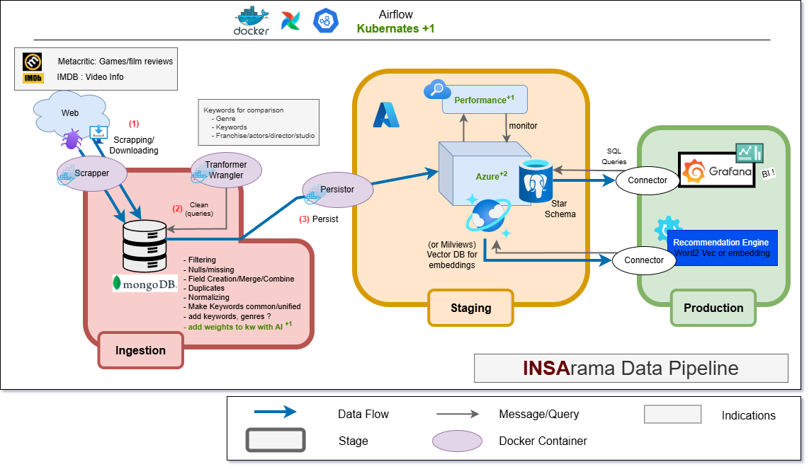
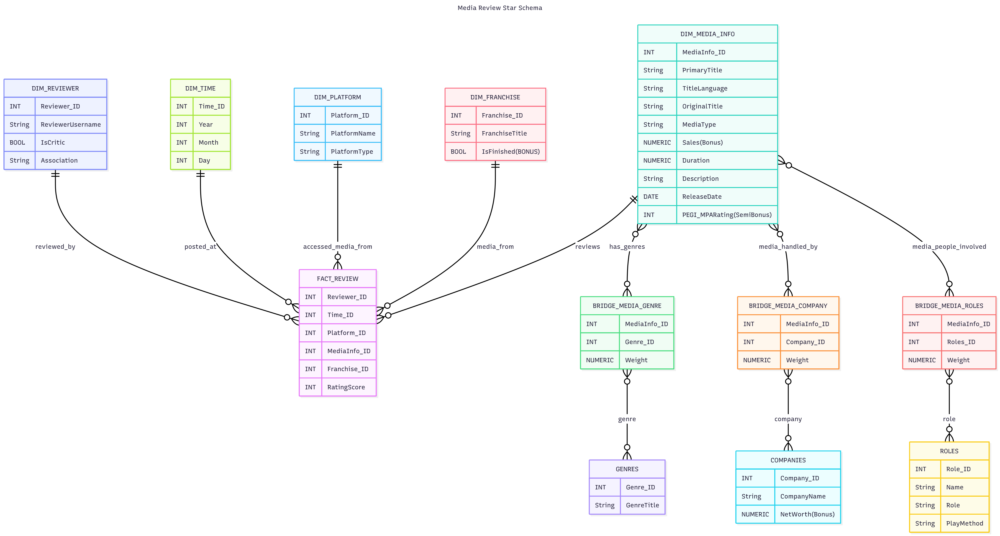

# DataEng 2025 INSArama Project

Project [DATA Engineering](https://www.riccardotommasini.com/courses/dataeng-insa-ot/) is provided by [INSA Lyon](https://www.insa-lyon.fr/).

## Students: 
- **Doha ES-SOUFI**
- **Jassir HABBA**
- **Diego LARRAZ MARTIN**

## Abstract

## Datasets Description 

## Pipeline

## Staging

- ### <table> <tr><th></th> <th>SQL Media Star Schema</th> </tr></table>

- ### <table> <tr><th></th> <th>VectorDB Embedding Schema</th> </tr></table>

## Queries 

## Requirements

## Institute logo

